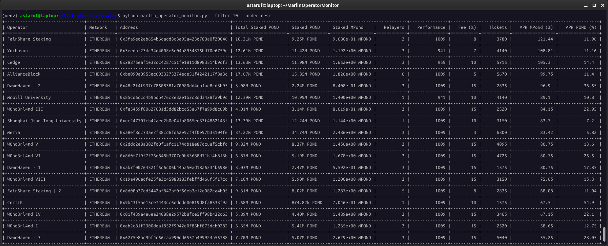

# MarlinOperatorMonitor
A simple Python CLI tool that fetches, parses, and displays staking data for Marlin operator nodes, including POND and MPOND balances, commissions, rewards, and performance metrics. 

Useful for delegators looking to explore operator statistics, compare rewards, and evaluate staking options.

---

## Features

- Fetches real-time staking, operator, and reward data
- Sorts by total stake, relayers, performance, commission, and more
- Supports both POND and MPOND stakes with readable formatting
- Clean tabular output using `tabulate`
- Command-line sorting and ordering options

---

## Usage

```bash
pip install -r requirements.txt
python marlin_operator_monitor.py [-f FILTER_INDEX] [-o ORDER]
```

### Options
```bash
options:
  -h, --help            show this help message and exit
  -f FILTER, --filter FILTER
                        Column index to sort by (default 3)
  -o {asc,desc}, --order {asc,desc}
  --format {table,csv,json,tsv,markdown}
```
### Example
```bash
python marlin_operator_monitor.py -f 10 -o desc
```
Sorts by MPond APR in descending order.

### Screenshot



### Filter Column Index Reference

| Index | Column Name         | Description                                          |
|-------|---------------------|------------------------------------------------------|
| 0     | Operator            | Name of the node operator                            |
| 1     | Network             | Network the node is connected to                     |
| 2     | Address             | Node address                                         |
| 3     | Total Staked POND   | Combined stake (POND + MPond converted to POND)      |
| 4     | Staked POND         | Raw amount of POND staked                            |
| 5     | Staked MPond        | Raw amount of MPond staked                           |
| 6     | Relayers            | Number of active relayers                            |
| 7     | Fee (%)             | Operator's commission percentage                     |
| 8     | Performance         | Node latency score                                   |
| 9     | Tickets             | Number of participations (tickets)                   |
| 10    | APR MPond (%)       | Estimated reward rate in MPond                       |
| 11    | APR POND (%)        | Estimated reward rate in POND                        |

---

## License

This project is licensed under the [MIT License](LICENSE).

## Disclaimer

This tool is **not affiliated** with the Marlin Protocol.  
It is provided **as-is**, and while fully functional, it is still **experimental**.  
Use it at your own discretion and risk.
